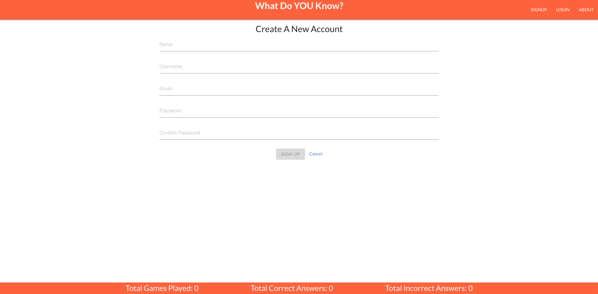
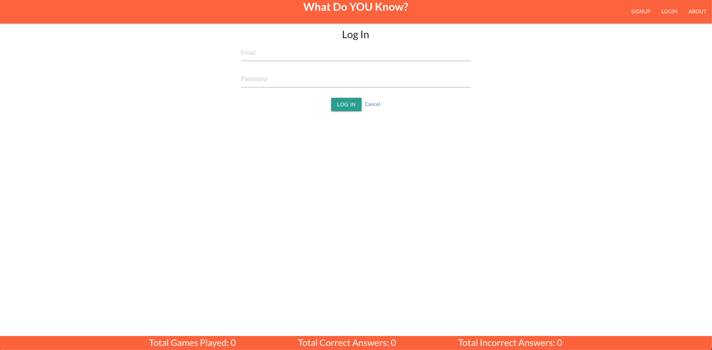
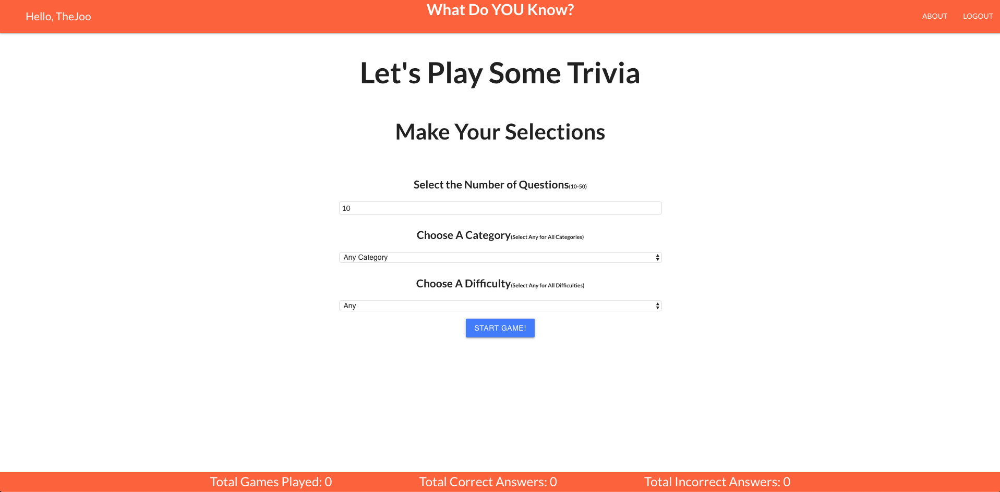
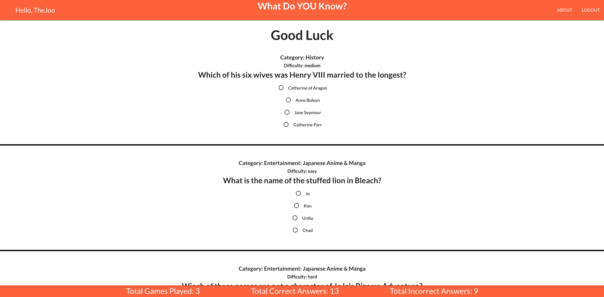
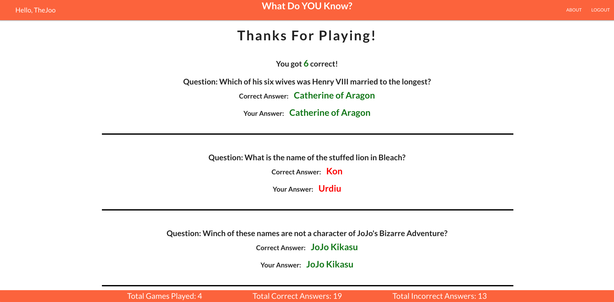

# What Do You Know?

## Description
### What do you know? Put your general knowledge to the test to see how much you really know.  Answer up to 50 questions on various topics and difficulty levels. 
---

## Screenshots
#### Homepage

#### Signup Page

#### Login Page

#### Options Page

#### Trivia Page

#### Results Page

## Technology Used
- React
- Express
- Node
- Mongoose
- OpenTriviaAPI
- Materialize
- Semantic-UI

## Getting Started
[Link to What Do You Know](https://triviawhatdoyouknow.herokuapp.com/)

[Link to Trello](https://trello.com/b/YQ9poumC/project-4)

## Next Steps
### Build a top scores page

